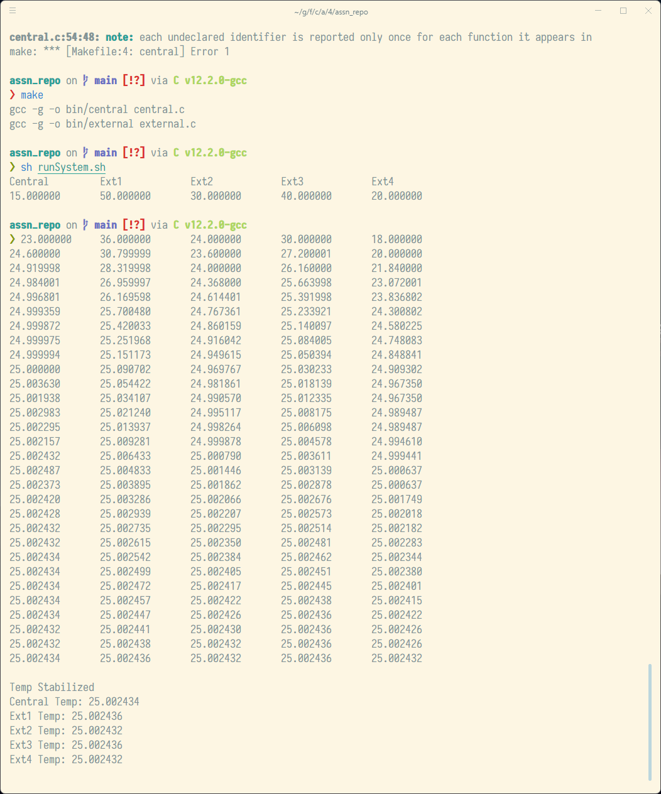

# CSE4001 Assignment 4
### Temperature Stabilization (IPC)
Grant Butler | [gbutler2020@my.fit.edu](mailto:gbutler2020@my.fit.edu) | [904.423.9358](tel:9044239358)

Using the starter code given, I was able to get a flag to be in the shared memory between the external processes and the central process. Using the central to store the previous temps and check if the new ones are the same as what was previously sent, I could then set the flag as true and stop the loops, then I could print the temp where they were when it stabilized.

Setting flag in `central.c`:
```c
Temp[5] = 0;  // flag

int stabilized = (int)Temp[5];
while (!stabilized) {
    ...
    // checking for same temps
    if ((Temp[1] == prev[1]) && (Temp[2] == prev[2]) && (Temp[3] == prev[3]) && (Temp[4] == prev[4]))
    {
        stabilized = 1;
    }

    // storing previous temps
    for (int i = 0; i <= 4; i++)
    {
        prev[i] = Temp[i];
    }
}
```

Using flag in `external.c`:
```c
int stabilized = (int)Temp[5];

while (!stabilized)
{
    ...
    // always checking to see if it is stabilized
    stabilized = (int)Temp[5];
    ...
}
```

By checking for the stabilized flag every time the loop runs, the external processes will stop as soon as the central decides that the temps have stabilized.

Example run:
```bash
assn_repo on  main [!?] via C v12.2.0-gcc 
❯ sh runSystem.sh
Central         Ext1            Ext2            Ext3            Ext4
15.000000       50.000000       30.000000       40.000000       20.000000
23.000000       36.000000       24.000000       30.000000       18.000000
24.600000       30.799999       23.600000       27.200001       20.000000
24.919998       28.319998       24.000000       26.160000       21.840000
24.984001       26.959997       24.368000       25.663998       23.072001
24.996801       26.169598       24.614401       25.391998       23.836802
24.999359       25.700480       24.767361       25.233921       24.300802
24.999872       25.420033       24.860159       25.140097       24.580225
24.999975       25.251968       24.916042       25.084005       24.748083
24.999994       25.151173       24.949615       25.050394       24.848841
25.000000       25.090702       24.969767       25.030233       24.909302
25.003630       25.054422       24.981861       25.018139       24.967350
25.001938       25.034107       24.990570       25.012335       24.967350
25.002983       25.021240       24.995117       25.008175       24.989487
25.002295       25.013937       24.998264       25.006098       24.989487
25.002157       25.009281       24.999878       25.004578       24.994610
25.002432       25.006433       25.000790       25.003611       24.999441
25.002487       25.004833       25.001446       25.003139       25.000637
25.002373       25.003895       25.001862       25.002878       25.000637
25.002420       25.003286       25.002066       25.002676       25.001749
25.002428       25.002939       25.002207       25.002573       25.002018
25.002432       25.002735       25.002295       25.002514       25.002182
25.002432       25.002615       25.002350       25.002481       25.002283
25.002434       25.002542       25.002384       25.002462       25.002344
25.002434       25.002499       25.002405       25.002451       25.002380
25.002434       25.002472       25.002417       25.002445       25.002401
25.002434       25.002457       25.002422       25.002438       25.002415
25.002434       25.002447       25.002426       25.002436       25.002422
25.002432       25.002441       25.002430       25.002436       25.002426
25.002432       25.002438       25.002432       25.002436       25.002426
25.002434       25.002436       25.002432       25.002436       25.002432

Temp Stabilized
Cent Temp: 25.002434
Ext1 Temp: 25.002436
Ext2 Temp: 25.002432
Ext3 Temp: 25.002436
Ext4 Temp: 25.002432

```
<details><summary>
Screenshot
</summary>


</details>