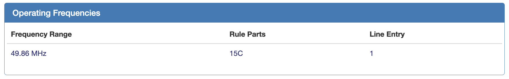
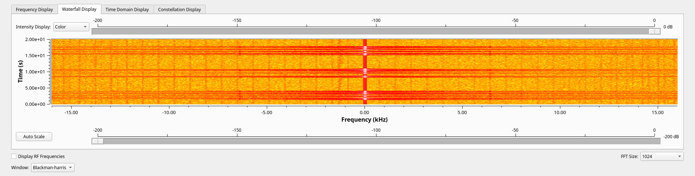

# CSE4820 Lab 4: SDR
#### Grant Butler, Alex Schmith, Will Hottenstein, Chandler Hake

### Table of Contents

[TOC]

#### Tasks

##### 1. Finding the Frequency

At [https://fccid.io/2AE67-2104B](https://fccid.io/2AE67-2104B), we found that the operating frequency is `49.86` MHz.

*operating freq from website*

##### 2. Determine Specific Freq
Using `gnuradio`, we were able to record the RF to record the frequencies of the radio signal from the remote to the car. This showed that the frequency of the radio being sent was right at `49.86` MHz.

*graph in gnu radio showing peaks at `49.86` MHz*

##### 3. Determine Modulation

##### 4. Uncover Encoding

##### 5. Figuring out Protocol