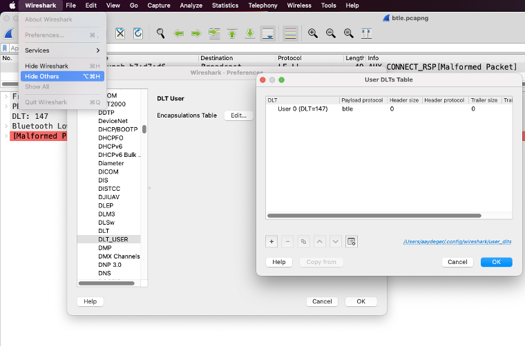
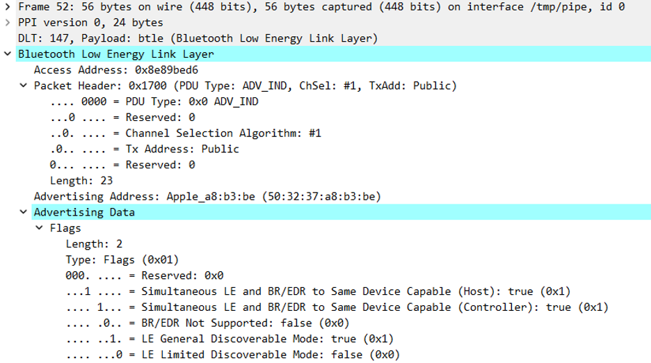
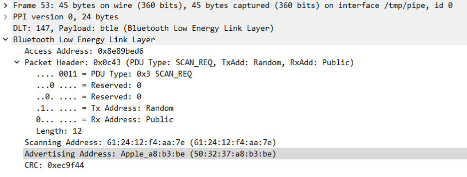
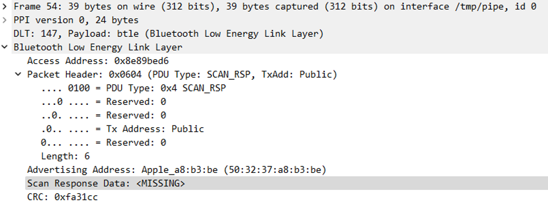
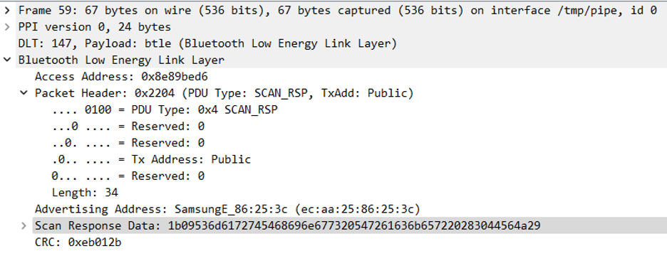

**CSE 4820 – Fall 2022**

**Midterm**

**Due: 10/13/2022 10:45AM**

1. What are the reasons Wifi deauth attack works? What is the main problem/vulnerability that the attack targets and what is the main goal to achieve at the end? Please use cybersecurity terms (e.g., cybersecurity triad etc.) to discuss your answer. (20p)

Wifi deauth works because 802.11 has frames that are used to tell the access point that the client device wants to disconnect from the network. The main problem being targeted is the availability of these frames being spoofed to the access point. The main goal of this type of attack is to exploit the vulnerabilities in the integrity of the protocol, usually allowing the capture of an authentication between the client and access point, to then be used to crack the key or passphrase of the network. This renders the confidentiality of wifi as a secure connection as useless in many cases when the correct cryptographic securities are not set up properly.

2. Let’s consider you have cracked the Wifi password via WPA2 brute force attack. What can you do with this afterwards? For instance, can you understand the traffic passing on the same Wifi network? Can you have a direct access (launching any script etc.) to another device that is connected to the Wifi AP? Please elaborate. (20p)

After brute forcing the WPA2 encryption on a wifi network, you can use your connection to listen to the traffic on the network, including packets being sent to/from applications on the client device and a host somewhere else, and you can see all of that traffic. In many cases the size of the packet and the headers are visible, so a lot of typical protocols (HTTP, FTP, SSH) can then be exploited with that data. If the security on a client on the network has a vulnerability, for instance a remote pc connection software on all Windows devices, this could lead to a remote code execution (RCE) on the device allowing a malicious user to gain root access to the device, wreaking havoc on someone on the wifi access point.

3. What can go wrong with connecting and using open access wireless network (e.g., Starbucks)? What can you do to protect yourself against? Please explain any problem/solution you provide as how it would realistically work. (15p)

When connecting to an open access network without any security, it is very easy for someone to start sniffing the traffic between a client and the wifi AP. For instance, one could connect to their server that holds confidential information in it, hoping to do some maintenance for their job that is needed to get a service up and running again after an outage. In doing so on the open network, they run the risk that a malicious hacker is listening to the traffic and notices that there is an SSH connection and decides to follow it. This leads to them getting into the server and collecting information stored about customers of the service, and they eventually decide to leak that information to other malicious hackers. 

In order to help prevent this kind of attack on an open network, many use a Virtual Private Network (VPN) on their device. When connected to a VPN, the traffic from the client device is masked by a tunnel, and all of the traffic shows a connection to the VPN’s IP instead of the actual server. This obscurity provides confidentiality even on a public network, so the malicious hacker can’t find the server that is being connected to, and instead can only see the VPN server. This is constantly available to be used, as long as the VPN server is online and connected to, while having good integrity, as all of the data in the tunnel is encrypted and is reliably delivered between the host and client.

4. You are assigned to develop a Bluetooth sniffer for Company XYZ. How do you approach to such task and what are the steps you can come up with to accomplish this? What are the challenges for such task? What (e.g., devices, tools, software, etc. ) do you need to complete and test it? Please make sure to provide any assumption you make. (25p)

To start sniffing Bluetooth traffic, first understanding connection is important. Sniffing the traffic for a connection request can be used to crack the security of the devices. After finding the advertisement of devices nearby, finding the specific device to be targeted is easy with an nRF sniffer. Then with ubertooth or Nordic you can capture the traffic. Using that, the type of encryption can be determined. There are two different types of security for the connection, including Link Keys and Secure Simple Pairing (SSP). 

Link keys are easier to crack, and by sniffing the link key generation and authentication, only a brute force of the pin until the signed response (SRES) matches is needed. Sometimes newer devices use something called Out of Band (OOB), which is used to support legacy devices. In this case the key is just needed to crack the authentication.

For SSP, the authentication step of the process can be different, requiring different information to crack each. Instead of trying to crack each one, using an attack called Niño can be used to manipulate what kind of security is being used to connect. When the devices are pairing they tell each other if they have IOCapability, and by disconnecting the devices and jamming connection, the attack then stops jamming to send the address and name of the devices to spoof connection to both devices as if they didn’t have IOCapabilities, so they use a version of numeric comparison called just works, which is easily exploitable with the public keys and nonces they both have.

To complete this attack a bluetooth antenna and software like ubertooth/Nordic nRF and crackle are needed. This is assuming that the bluetooth devices to be attacked are nearby, since bluetooth is a low range protocol, and an attack like Niño also depends on the user of the devices to not notice that something malicious is happening.

5. Work on the provided pcap file and list and technically explain in detail 3-5 packet examples and important information you may see from that capture. Please provide screenshots of the packets you pick. (20p)

    Hint: This is a Bluetooth packet capture and in order to properly view it in Wireshark, you may need to do following:

    • Wireshark (or Edit/View)→ Preferences → Protocol → DLT_USER • The payload protocol should to “btle”.	

Frame 52:

This packet is showing the advertisement of a device saying that it is discoverable and can be a host/controller. 

Frame 53:

This packet shows another device requesting to connect to the host device, as can be seen in the field `PDU Type: SCAN_REQ`. This could mean that there will be a connection captured between these two devices.

Frame 54: 

This frame is of type SCAN_RSP, but unfortunately the scan response data is not there, so there is no way to get more information from it.

Frame 59:

In this SCAN_RSP, it would seem that the scan response data could contain a hash of something, or even just the public key of the device. This could be used to start looking at an attack between it and another device.
